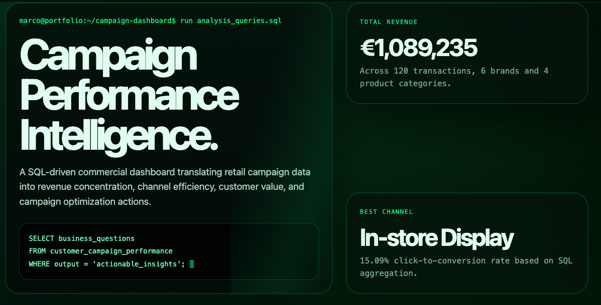
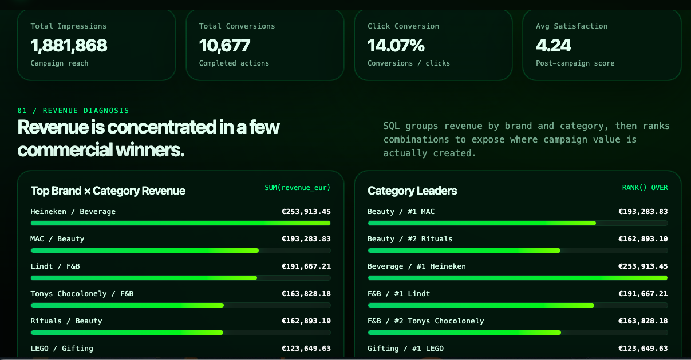
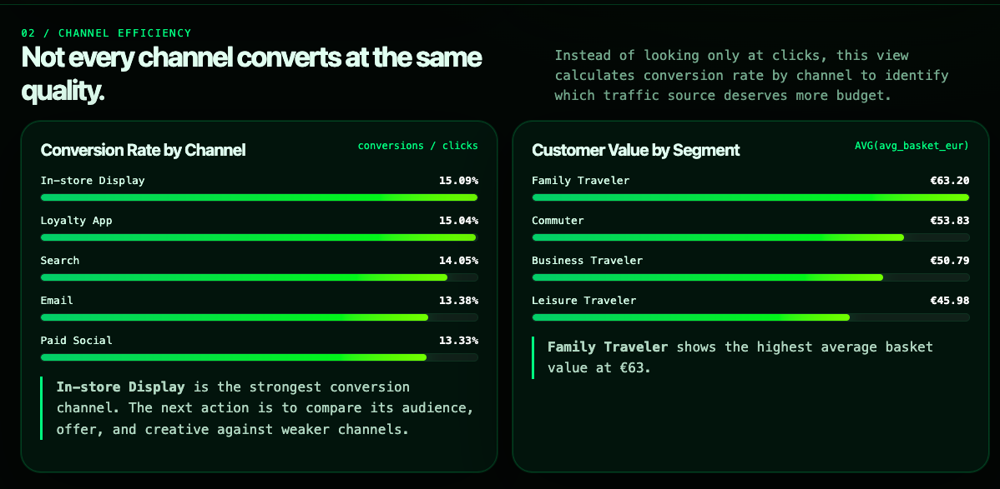

# SQL Customer Insights Dashboard for Schiphol Brands

A portfolio project based on airport retail and brand campaign coordination experience. This project simulates customer and campaign performance data for Schiphol retail brands and uses SQL to answer business questions around conversion, spend, basket size, and campaign effectiveness.

## Project Goal
Build a SQL-based analysis workflow that helps brand and retail teams understand:
- which brands perform best by category
- how campaign periods affect conversion and revenue
- which customer segments spend the most
- where underperforming touchpoints may need optimization

## My Contribution

- Defined the business questions
- Wrote SQL queries to analyze campaign performance
- Used grouping, aggregation, ranking, and filtering logic
- Interpreted revenue, conversion, basket value, and campaign efficiency metrics
- Created a portfolio-ready visualization layer using an AI-assisted HTML template
  
## Tech Stack
- SQL (PostgreSQL-compatible)
- CSV data source
- Optional BI connection via Power BI / Tableau / Looker Studio

## Files
- `schema.sql` – table structure
- `analysis_queries.sql` – business questions and SQL queries
- `sample_data.csv` – synthetic dataset
- `insights.md` – summary of findings
- `campaign_performance_dashboard.html` - AI-powered website that helps with dashboard visualization

## Sample Questions Answered
1. Which brands generated the highest total revenue?
2. Which campaign channels had the best conversion rate?
3. What was the average basket size by customer segment?
4. How did campaign periods impact performance for F&B vs beauty brands?
5. Which brands should be prioritized for promotional optimization?

## Resume Bullets
- Built a SQL-based customer insights dashboard using synthetic airport retail data to analyse brand performance, campaign conversion, and customer spending behavior.
- Wrote analytical SQL queries using `JOIN`, `GROUP BY`, window functions, and conditional aggregation to generate actionable recommendations for retail and campaign optimization.

## How to Use
1. Create a database.
2. Run `schema.sql`.
3. Import `sample_data.csv` into the `customer_campaign_performance` table.
4. Run `analysis_queries.sql`.

## Notes
This is a portfolio project using fictionalized data inspired by my work experience as a campaign marketing intern with retail/FMCG brands in an airport environment. The data in this portfolio is fake.

## Preview of Dashboard

